# WebService笔记


## 一、基本概念

### 1、什么是Web服务

列举一些常见的Web服务：

1. 手机淘宝、京东……

2. 天气预报
2. 手机号归属地
2. 股票查询
2. 发送手机短信
2. 手机充值功能
2. 中英文翻译
2. 银行转账业务
2. 公司的“进销存系统”在某商品缺货时自动给供应商下单


**WebService** 即Web服务，它是一种<span style="color:red;">跨编程语言</span>和<span style="color:red;">跨操作系统平台</span>的远程调用技术。

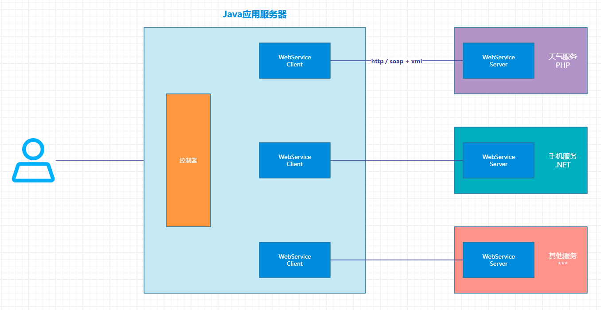


Java 中一共有三种 WebService 规范，分别是：

- JAX-WS（JAX-RPC）：**常用**，客户端和服务端的通讯协议使用 **SOAP协议**，传输数据使用 **XML格式**；
- JAXM&SAAJ
- JAX-RS：**常用**，通讯协议使用 **HTTP协议**，传输数据使用 **XML格式** 或 **JSON格式**；


WebService 三要素：SOAP、wsdl、UDDI


### 2、WebService开发规范

**JAX-WS**

Java API for XML-WebService，JDK1.6自带的版本为 `JAX-WS 2.1`，其底层支持为 JAXB。

JAX-WS（JSR 224）规范的API位于 `javax.xml.ws.*` 包，其中大部分都是注解，提供API操作Web服务（通常在客户端使用的较多，由于客户端可以借助SDK生成，因此这个包中的API我们很少直接使用）。


**JAXM&SAAJ**

Java API for XML Message，主要定义了包含发送和接收消息所需的API，相当于Web服务的服务端，其API位于 `javax.messaging.*` 包，它是Java EE的可选包，因此需要单独下载。


SAAJ（SOAP with Attachment API for Java，JSR 67）是与JAXM搭配使用的API，为构建SOAP包和解析SOAP包提供了重要的支持，支持附件传输，它在服务器端、客户端都需要使用。这里还要提到的是 SAAJ 规范，其API位于 `javax.xml.soap.*` 包。


JAXM&SAAJ 与 JAX-WS 都是基于 SOAP 的Web服务，相比之下：

JAXM&SAAJ 暴露了 SOAP 更多的底层细节，编码比较麻烦，

而 JAX-WS 更加抽象，隐藏了更多的细节，更加面向对象，在使用过程中开发者不需要关心 SOAP 的任何细节。

如果开发者想要控制 SOAP 消息的更多细节，可以使用 JAXM&SAAJ。


**JAX-RS**

JAX-RS 是 Java 针对 REST 风格制定的一套Web服务规范，由于推出的相对较晚，该规范并未随JDK1.6一起发行，开发者需要到 JCP 上单独下载 JAX-RS 规范的接口，其API位于 `javax.ws.rs.*` 包。

这里的 JAX-WS 和 JAX-RS 规范我们采用 <span style="color:red;">Apache CXF</span>作为实现。


### 3、SOAP协议

Simple Object Access Protocol，即**简单对象访问协议**，它是用于交换XML编码信息的轻量级协议。

它有三个主要方面：

​	XML-envelope为描述信息内容和如何处理内容定义了框架，

​	将程序对象编码成为XML对象的规则，

​	执行远程过程调用（RPC）的约定。

<span style="color:red;">SOAP 可以运行在任何其他传输协议上。</span>

SOAP是一个基于XML语言和HTTP的协议，SOAP = HTTP + XML数据。

**SOAP的组成如下**：

- Envelope - 必须，以XML的根元素出现
- Headers - 可选
- Body - 必须，在Body部分，包含要执行的服务器端的方法和发送到服务器端的数据


### 4、wsdl说明书

WebService Definition Language，WebService定义语言，是用机器能理解的方式提供一个（基于XML的）正式描述文档的一种语言。

用于描述WebService及其函数、参数和返回值。因为是基于XML的，所以wsdl既是机器可以理解的，又是人类可阅读的。

1.通过wsdl说明书，可以描述WebService服务端对外发布的服务；

2.wsdl说明书是一个基于XML的文件，通过XML语言描述整个服务；

3.<span style="color:red;">在wsdl说明书中，描述了：</span>

- 对外发布的服务名称（类）
- 接口方法名称（方法）
- 接口参数（方法参数）
- 服务返回的数据类型（方法返回值）


### 5、UDDI

Web服务提供商要将自己开发的Web服务公布到因特网上，就需要使用到UDDI了。

UDDI是一个跨产业、跨平台的开放性架构，可以帮助Web服务提供商在互联网上公布Web服务的信息。

UDDI是一种目录服务，开发者可以通过UDDI来注册和搜索Web服务。

简单来说，UDDI是一个关于Web服务信息的目录，并且UDDI通过 **SOAP** 进行通讯，是基于 `.NET` 构建的。

UDDI 即 Universal Description, Discovery and Integration，也就是通用描述，发现和整合。


### 6、应用场景

WebService可以适用于应用程序集成、软件重用、跨防火墙通信的等需求。不同的业务要求不同。

简单来说，如果一个功能需要被多个系统使用，可以利用WebService开发一个服务端接口，以供不同的客户端应用。主要应用在企业内部系统之间的接口调用、面向公网的WebService服务。

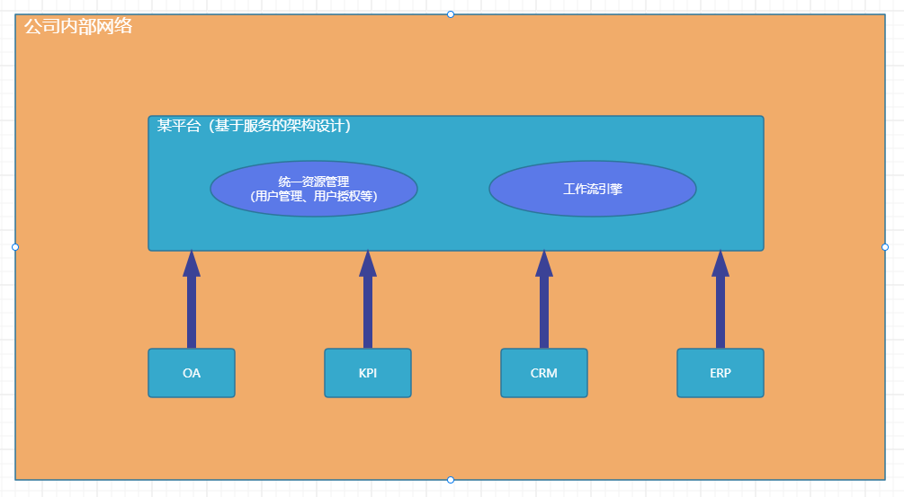

**优点**：

- <span style="color:blue;">异构平台的互通性</span>

> 理论上，WebService最大的优势是提供了异构平台的无缝衔接技术手段。
>
> 由于不同的用户使用不同的硬件平台、不同的操作平台、不同的操作系统、不同的软件、不同的通信协议，这就产生了互相通信的需求。
>
> WebService使任何两个应用程序，只要能读写XML，那么就能互相通信。

- <span style="color:blue;">更广泛的软件复用（例如移动端淘宝可以复用Web端淘宝的业务逻辑）</span>

> 软件的复用技术通过组合已有模块来搭建应用程序，能大幅度提高软件的生产效率和质量。用户只要获得了wsdl文件，就可以方便地生成客户端代理，并通过代理访问WebService。

- <span style="color:blue;">成本低、可读性强、应用范围广</span>

> WebService可用基于XML的SOAP来表示数据和调用请求。并且通过HTTP协议传输XML格式的数据。

- <span style="color:blue;">迅捷的软件发行方式</span>

> 每个WebService称为一个生产者，不同的生产者可以互相协同合作完成整个应用。
>
> WebService将彻底地改变软件的发行方式。
>
> 软件供应商可以把软件分解成若干个WebService模块构成的系统，直接在Web上发布。

- <span style="color:red;">跨编程语言的数据通信</span>

> 客户端与服务端可能是用不同的语言开发的，但是通过WebService提供服务接口，客户端与服务端之间可以传递对象数据。


**缺点**：

由于 SOAP 是基于 XML 传输，本身使用XML传输会携带一些无关内容从而影响传输效率，

随着SOAP协议的完善，协议增加了许多内容，这就导致了即使用 SOAP 去完成一个简单的数据传输也会因为携带的信息更多而影响传输效率。


WebService作为Web跨平台访问的标准技术，很多公司都限定要求使用WebService，但如果是简单的接口可以直接使用http传输自定义数据格式，开发更快捷。


### 7、面向服务的架构SOA

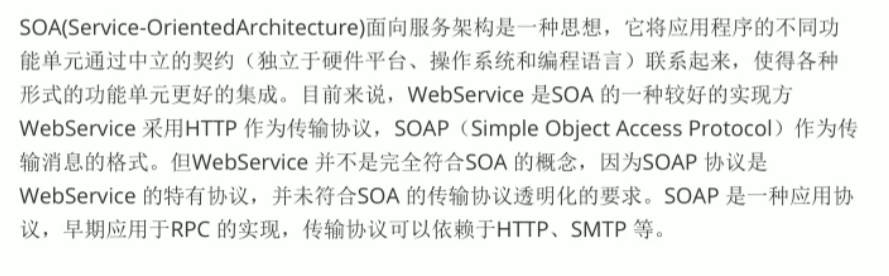

<span style="color:red;">WebService可以作为SOA的其中一种实现。</span>


## 二、Apache CXF框架

### 1、关于Apache CXF

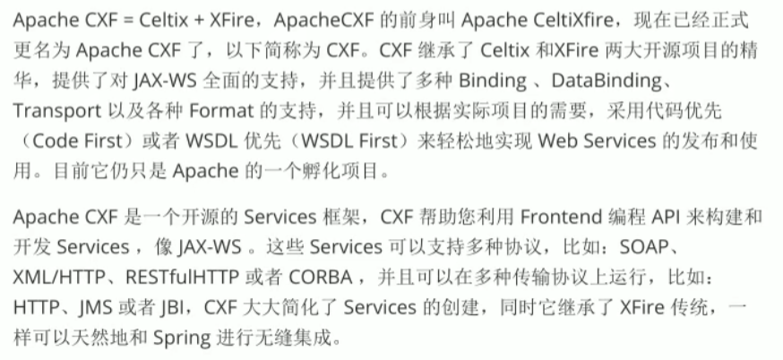


### 2、WebService实现（JAX-WS）

#### 服务端

**1.创建项目**

<span style="color:blue;">①创建一个空项目工程</span>

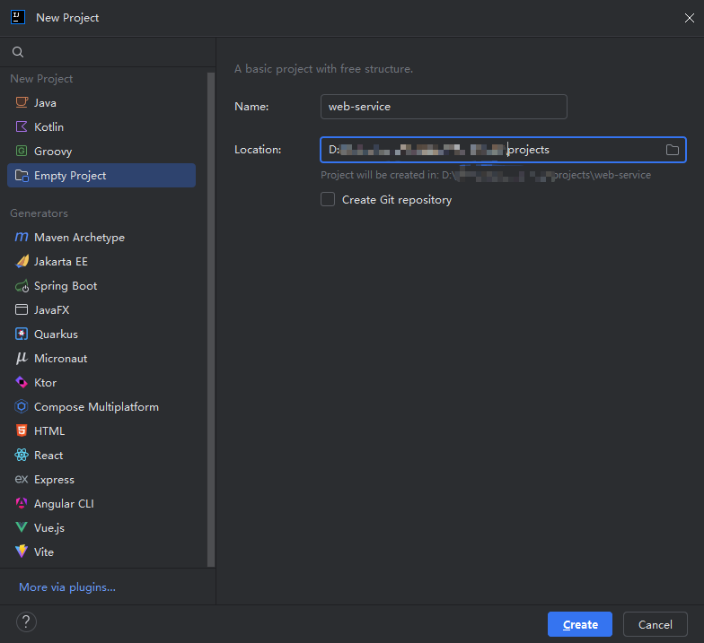

<span style="color:blue;">②添加服务端Module</span>

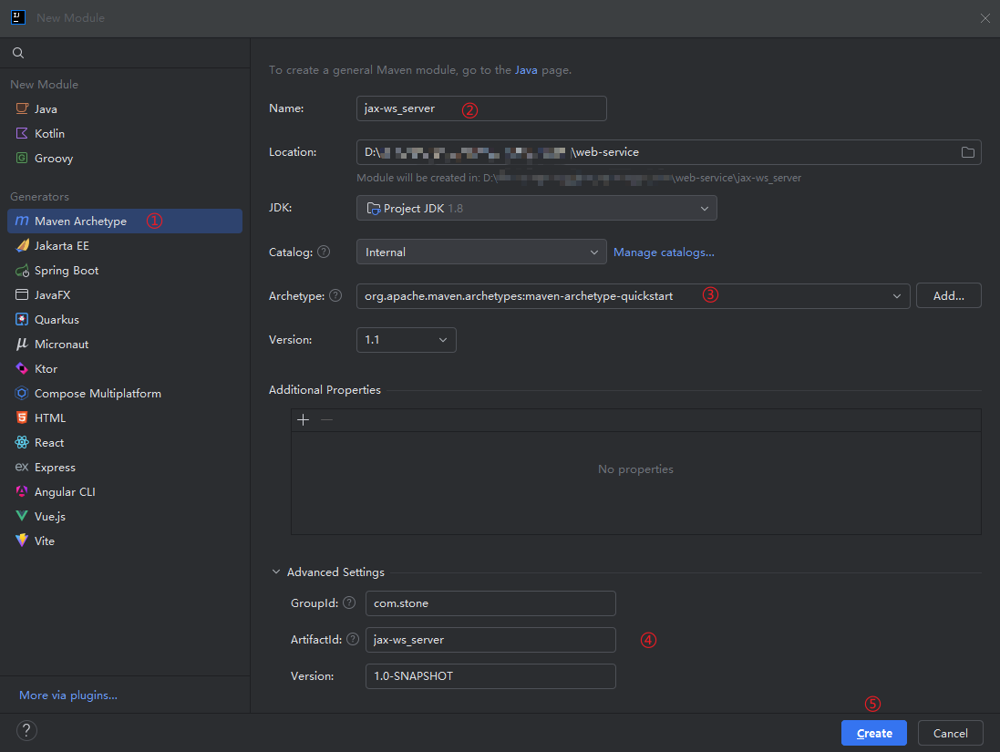


**2.添加CXF依赖**

<span style="color:blue;">①在服务端Module中添加Apache CXF的依赖</span>

```xml
<project xmlns="http://maven.apache.org/POM/4.0.0" xmlns:xsi="http://www.w3.org/2001/XMLSchema-instance"
  xsi:schemaLocation="http://maven.apache.org/POM/4.0.0 http://maven.apache.org/xsd/maven-4.0.0.xsd">
  <modelVersion>4.0.0</modelVersion>

  <groupId>com.stone</groupId>
  <artifactId>jax-ws_server</artifactId>
  <version>1.0-SNAPSHOT</version>

  <name>jax-ws_server</name>

  <dependencies>
    <!--要进行JAX-WS服务开发-->
    <dependency>
      <groupId>org.apache.cxf</groupId>
      <artifactId>cxf-rt-frontend-jaxws</artifactId>
      <version>3.5.7</version>
    </dependency>
    <!--内置jetty web服务器（若整合在一个Web项目中，项目自带Tomcat则不需要此依赖）-->
    <dependency>
      <groupId>org.apache.cxf</groupId>
      <artifactId>cxf-rt-transports-http-jetty</artifactId>
      <version>3.5.7</version>
    </dependency>
    <!--日志实现-->
    <dependency>
      <groupId>org.slf4j</groupId>
      <artifactId>slf4j-log4j12</artifactId>
      <version>2.0.7</version>
    </dependency>
    <!--junit-->
    <dependency>
      <groupId>junit</groupId>
      <artifactId>junit</artifactId>
      <version>4.13.2</version>
      <scope>test</scope>
    </dependency>
  </dependencies>

  <build>
    <pluginManagement>
      <plugins>
        <plugin>
          <groupId>org.apache.maven.plugins</groupId>
          <artifactId>maven-compiler-plugin</artifactId>
          <version>3.13.0</version>
          <configuration>
            <source>1.8</source>
            <target>1.8</target>
            <encoding>UTF-8</encoding>
            <showWarnings>true</showWarnings>
          </configuration>
        </plugin>
      </plugins>
    </pluginManagement>
  </build>

</project>
```


**3.编写服务接口**

<span style="color:blue;">①新建接口 `com.stone.service.HelloService`</span>

```java
package com.stone.service;

import javax.jws.WebService;

/**
 * 对外发布服务的接口
 */
@WebService
public interface HelloService {

    /**
     * 对外发布服务的接口的方法
     */
    String sayHello(String name);
}
```


**4.编写服务接口的实现**

<span style="color:blue;">①新建实现类 `com.stone.service.impl.HelloServiceImpl`</span>

```java
package com.stone.service.impl;

import com.stone.service.HelloService;

public class HelloServiceImpl implements HelloService {

    @Override
    public String sayHello(String name) {
        return "Hello " + name + ", welcome to server!";
    }
}
```


**5.发布服务**

<span style="color:blue;">①编写一个测试类 `com.stone.ServerTest`，来测试发布服务</span>

```java
package com.stone;

import com.stone.service.impl.HelloServiceImpl;
import org.apache.cxf.jaxws.JaxWsServerFactoryBean;

/**
 * 发布服务的测试类
 */
public class ServerTest {

    public static void main(String[] args) {
        // 发布服务的工厂实例
        JaxWsServerFactoryBean factory = new JaxWsServerFactoryBean();
        // 配置服务地址
        factory.setAddress("http://localhost:12301/ws/hello");
        // 配置服务类
        factory.setServiceBean(new HelloServiceImpl());
        // 发布服务
        factory.create();

        System.out.println("发布服务成功，端口12301……");
    }
}
```

<span style="color:blue;">②执行测试类中的方法，查看运行结果</span>

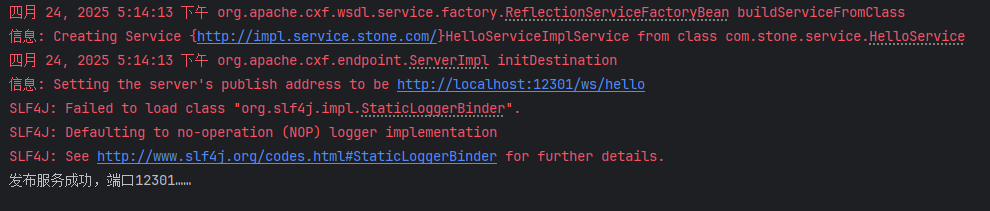


**6.访问wsdl说明书**

<span style="color:blue;">wsdl说明书访问地址：</span>http://localhost:12301/ws/hello?wsdl

<span style="color:red;">wsdl说明书的阅读顺序是从底部向顶部的</span>

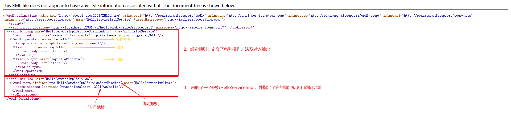


#### 客户端

**1.创建项目**

<span style="color:blue;">①添加客户端Module</span>

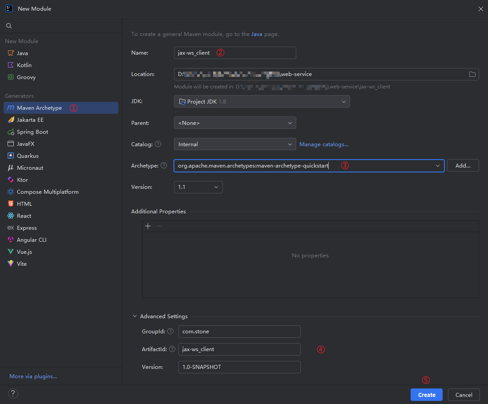


**2.添加CXF依赖**

<span style="color:blue;">添加的依赖和服务端是一样的。</span>


**3.编写服务接口**

<span style="color:blue;">与服务端一样，新建一个接口 `com.stone.service.HelloService`</span>


**4.调用服务**

<span style="color:blue;">①编写一个测试类 `com.stone.ClientTest`，来测试服务调用</span>

```java
package com.stone;

import com.stone.service.HelloService;
import org.apache.cxf.jaxws.JaxWsProxyFactoryBean;

/**
 * 调用服务的测试类
 */
public class ClientTest {

    public static void main(String[] args) {
        // 创建cxf代理工厂
        JaxWsProxyFactoryBean factory = new JaxWsProxyFactoryBean();
        // 配置服务接口访问地址：http://localhost:12301/ws/hello
        factory.setAddress("http://localhost:12301/ws/hello");
        // 配置接口类型（服务的接口规范）
        factory.setServiceClass(HelloService.class);
        // 对接口生成代理对象
        HelloService helloService = factory.create(HelloService.class);
        // 可以查看下代理对象
        // Java中的代理分为：
        // 1.静态代理
        // 2.动态代理（jdk接口代理 $Proxy***、cglib子类代理 $CGLIB***）
        System.out.println(helloService.getClass());
        // 远程调用服务端方法
        String result = helloService.sayHello("Stone");
        System.out.println("调用服务接口：" + result);
    }
}
```

<span style="color:blue;">②执行测试类中的方法，查看运行结果</span>

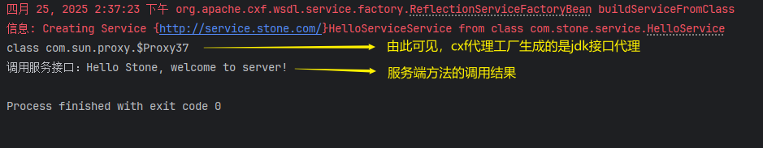


#### 观察SOAP请求&响应内容格式

<span style="color:green;">通过添加ApacheCXF日志拦截器观察 SOAP 请求、响应的内容格式</span>

①首先在服务端添加资源目录，并添加文件`log4j.properties`

```properties
log4j.rootCategory=INFO, CONSOLE, LOGFILE
log4j.logger.org.apache.axis.enterprise=FATAL, CONSOLE
log4j.appender.CONSOLE=org.apache.log4j.ConsoleAppender
log4j.appender.CONSOLE.layout=org.apache.log4j.PatternLayout
log4j.appender.CONSOLE.layout.ConversionPattern=%d{ISO8601} %-6r[%15.15t]%5p %30.30c %x - %m%n
log4j.appender.LOGFILE=org.apache.log4j.FileAppender
log4j.appender.LOGFILE.File=/tmp/axis.log
log4j.appender.LOGFILE.Append=true
log4j.appender.LOGFILE.layout=org.apache.log4j.PatternLayout
```


②修改服务端测试代码，添加日志拦截器

```java
package com.stone;

import com.stone.service.impl.HelloServiceImpl;
import org.apache.cxf.interceptor.LoggingInInterceptor;
import org.apache.cxf.interceptor.LoggingOutInterceptor;
import org.apache.cxf.jaxws.JaxWsServerFactoryBean;

/**
 * 发布服务的测试类
 */
public class ServerTest {

    public static void main(String[] args) {
        // 发布服务的工厂实例
        JaxWsServerFactoryBean factory = new JaxWsServerFactoryBean();
        // 配置服务地址
        factory.setAddress("http://localhost:12301/ws/hello");
        // 配置服务类
        factory.setServiceBean(new HelloServiceImpl());

        // 添加日志输入、输出拦截器，观察 SOAP请求、SOAP响应内容
        factory.getInInterceptors().add(new LoggingInInterceptor());
        factory.getOutInterceptors().add(new LoggingOutInterceptor());

        // 发布服务
        factory.create();

        System.out.println("发布服务成功，端口12301……");
    }
}
```


③重新发布并调用服务后，查看服务端的控制台日志打印

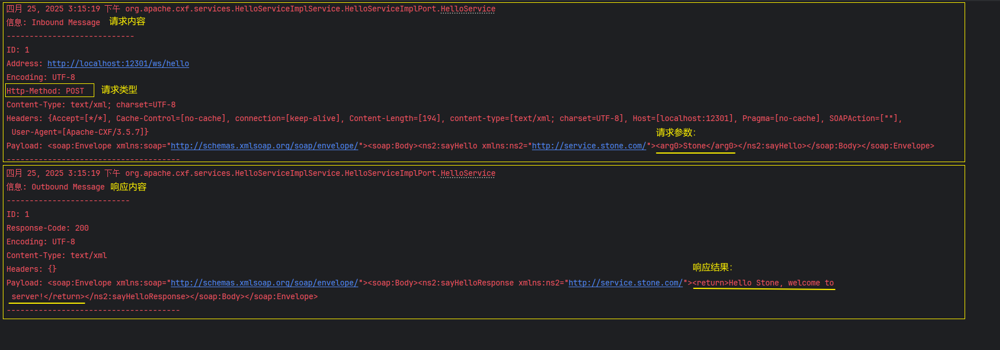


## 三、Spring整合ApacheCXF

<b style="color:red;">Target：基于JAX-WS规范，通过Spring整合ApacheCXF，实现WebService</b>

### 服务端

#### 1.创建Web项目

<span style="color:blue;">①在之前的项目工程下创建一个**Web**的新Module，作为服务端项目</span>

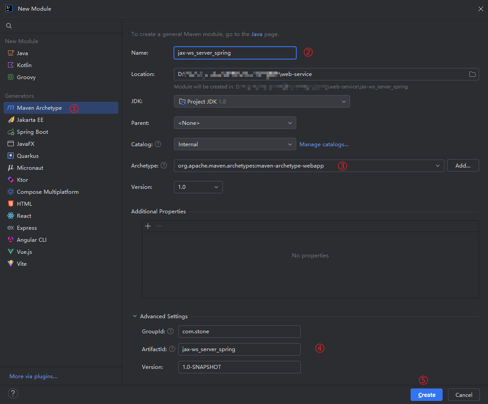


#### 2.添加依赖

<span style="color:blue;">①添加Spring及ApacheCXF的相关依赖</span>

```xml
<project xmlns="http://maven.apache.org/POM/4.0.0" xmlns:xsi="http://www.w3.org/2001/XMLSchema-instance"
         xsi:schemaLocation="http://maven.apache.org/POM/4.0.0 http://maven.apache.org/maven-v4_0_0.xsd">
    <modelVersion>4.0.0</modelVersion>
    <groupId>com.stone</groupId>
    <artifactId>jax-ws_server_spring</artifactId>
    <packaging>war</packaging>
    <version>1.0-SNAPSHOT</version>
    <name>jax-ws_server_spring Maven Webapp</name>

    <dependencies>
        <!--CXF WS开发-->
        <dependency>
            <groupId>org.apache.cxf</groupId>
            <artifactId>cxf-rt-frontend-jaxws</artifactId>
            <version>3.5.7</version>
        </dependency>
        <!--junit-->
        <dependency>
            <groupId>junit</groupId>
            <artifactId>junit</artifactId>
            <version>4.13.2</version>
            <scope>test</scope>
        </dependency>
        <!--Spring相关依赖-->
        <dependency>
            <groupId>org.springframework</groupId>
            <artifactId>spring-context</artifactId>
            <version>5.3.12</version>
        </dependency>
        <dependency>
            <groupId>org.springframework</groupId>
            <artifactId>spring-web</artifactId>
            <version>5.3.12</version>
        </dependency>
        <dependency>
            <groupId>org.springframework</groupId>
            <artifactId>spring-test</artifactId>
            <version>5.3.12</version>
        </dependency>
    </dependencies>

    <build>
        <plugins>
            <!--编译插件-->
            <plugin>
                <groupId>org.apache.maven.plugins</groupId>
                <artifactId>maven-compiler-plugin</artifactId>
                <version>3.13.0</version>
                <configuration>
                    <source>1.8</source>
                    <target>1.8</target>
                    <encoding>utf-8</encoding>
                    <showWarnings>true</showWarnings>
                </configuration>
            </plugin>
            <!--Tomcat插件-->
            <plugin>
                <groupId>org.apache.tomcat.maven</groupId>
                <artifactId>tomcat7-maven-plugin</artifactId>
                <version>2.2</version>
                <configuration>
                    <!--指定端口-->
                    <port>8091</port>
                    <!--请求路径-->
                    <path>/</path>
                </configuration>
            </plugin>
        </plugins>
    </build>
</project>
```


#### 3.配置CXF Servlet

<span style="color:blue;">①在web.xml文件中配置CXF Servlet</span>

```xml
<!DOCTYPE web-app PUBLIC
        "-//Sun Microsystems, Inc.//DTD Web Application 2.3//EN"
        "http://java.sun.com/dtd/web-app_2_3.dtd" >

<web-app>
    <display-name>Archetype Created Web Application</display-name>

    <!--2.Spring容器配置-->
    <context-param>
        <param-name>contextConfigLocation</param-name>
        <param-value>classpath:applicationContext.xml</param-value>
    </context-param>
    <listener>
        <listener-class>org.springframework.web.context.ContextLoaderListener</listener-class>
    </listener>

    <!--1.cxf servlet配置-->
    <servlet>
        <servlet-name>cxfServlet</servlet-name>
        <servlet-class>org.apache.cxf.transport.servlet.CXFServlet</servlet-class>
    </servlet>
    <servlet-mapping>
        <servlet-name>cxfServlet</servlet-name>
        <url-pattern>/ws/*</url-pattern>
    </servlet-mapping>
</web-app>
```


<span style="color:blue;">②新建根目录文件夹及Spring配置文件 applicationContext.xml</span>

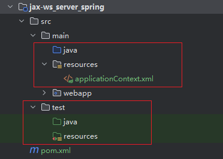

applicationContext.xml文件内容如下：

```xml
```


#### 4.服务接口&实现

https://www.bilibili.com/video/BV15t411S7V1?spm_id_from=333.788.player.switch&vd_source=71b23ebd2cd9db8c137e17cdd381c618&p=11


#### 5.Spring整合ApacheCXF


#### 6.启动服务，发布服务


#### 7.访问wsdl说明书


### 客户端


### END